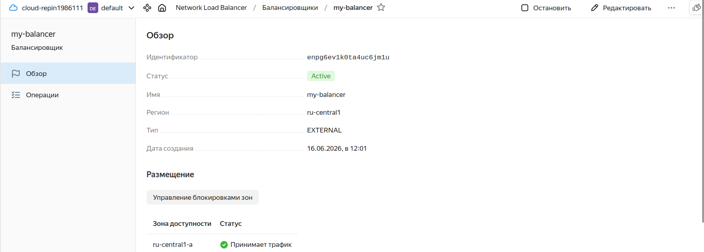
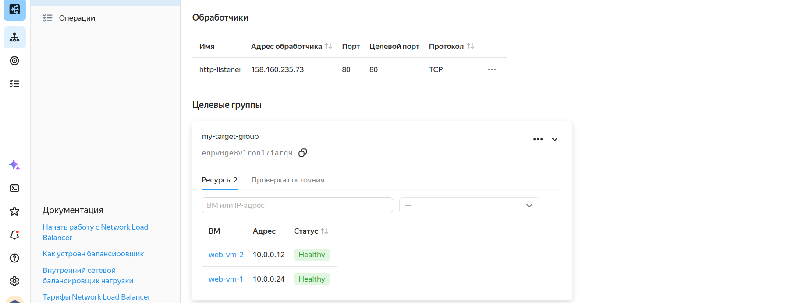
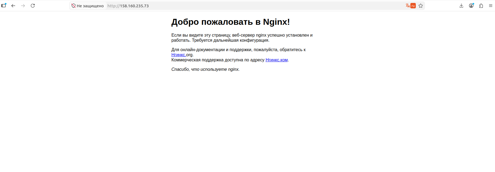

# Домашнее задание к занятию «Отказоустойчивость в облаке»

**ФИО:** Имя Фамилия

---

## Задание 1

Возьмите за основу решение к заданию 1 из занятия «Подъём инфраструктуры в Яндекс Облаке».

### Terraform Playbook

Создан Terraform playbook, который создаёт:
- 2 идентичные виртуальные машины (использован аргумент `count`)
- Целевую группу с созданными ВМ
- Сетевой балансировщик нагрузки, который слушает порт 80 и отправляет трафик на порт 80 ВМ с http healthcheck

```hcl
terraform {
  required_providers {
    yandex = {
      source = "yandex-cloud/yandex"
    }
  }
}

provider "yandex" {
  zone                     = "ru-central1-a"
  cloud_id                 = "b1g01nlvffov4b6r8ohh"
  folder_id                = "b1gpiada100cv18ok2im"
  service_account_key_file = "key.json"
}

resource "yandex_vpc_network" "my_network" {
  name = "my-network"
}

resource "yandex_vpc_subnet" "my_subnet" {
  name           = "my-subnet"
  zone           = "ru-central1-a"
  network_id     = yandex_vpc_network.my_network.id
  v4_cidr_blocks = ["10.0.0.0/24"]
}

resource "yandex_compute_instance" "web_vm" {
  count = 2
  
  name = "web-vm-${count.index + 1}"
  zone = "ru-central1-a"

  resources {
    cores  = 2
    memory = 2
  }

  boot_disk {
    initialize_params {
      image_id = "fd86f4jnl1l54imvihiu"
      size     = 20
    }
  }

  network_interface {
    subnet_id = yandex_vpc_subnet.my_subnet.id
    nat       = true
  }

  metadata = {
    user-data = <<-EOF
      #cloud-config
      packages:
        - nginx
      runcmd:
        - systemctl start nginx
        - systemctl enable nginx
    EOF
  }
}

resource "yandex_lb_target_group" "my_target_group" {
  name = "my-target-group"

  target {
    subnet_id = yandex_vpc_subnet.my_subnet.id
    address   = yandex_compute_instance.web_vm[0].network_interface[0].ip_address
  }

  target {
    subnet_id = yandex_vpc_subnet.my_subnet.id
    address   = yandex_compute_instance.web_vm[1].network_interface[0].ip_address
  }
}

resource "yandex_lb_network_load_balancer" "my_balancer" {
  name = "my-balancer"

  listener {
    name = "http-listener"
    port = 80
    target_port = 80
    external_address_spec {
      ip_version = "ipv4"
    }
  }

  attached_target_group {
    target_group_id = yandex_lb_target_group.my_target_group.id

    healthcheck {
      name = "healthcheck"
      http_options {
        port = 80
        path = "/"
      }
    }
  }
}
```

### Результаты

#### Скриншот 1: Балансировщик в статусе Active



#### Скриншот 2: Целевая группа со статусом Healthy



#### Скриншот 3: Страница Nginx



### Вывод

Все ресурсы успешно созданы:
- ✅ Балансировщик в статусе `Active`
- ✅ Обе ВМ в целевой группе в статусе `Healthy`
- ✅ Nginx доступен по внешнему IP балансировщика

**IP-адрес балансировщика:** `158.160.235.73`

---

## Ответы на вопросы

**1. Terraform Playbook** — предоставлен выше.

**2. Скриншот статуса балансировщика и целевой группы** — приложены.

**3. Скриншот страницы, которая открылась при запросе IP-адреса балансировщика** — приложен.
